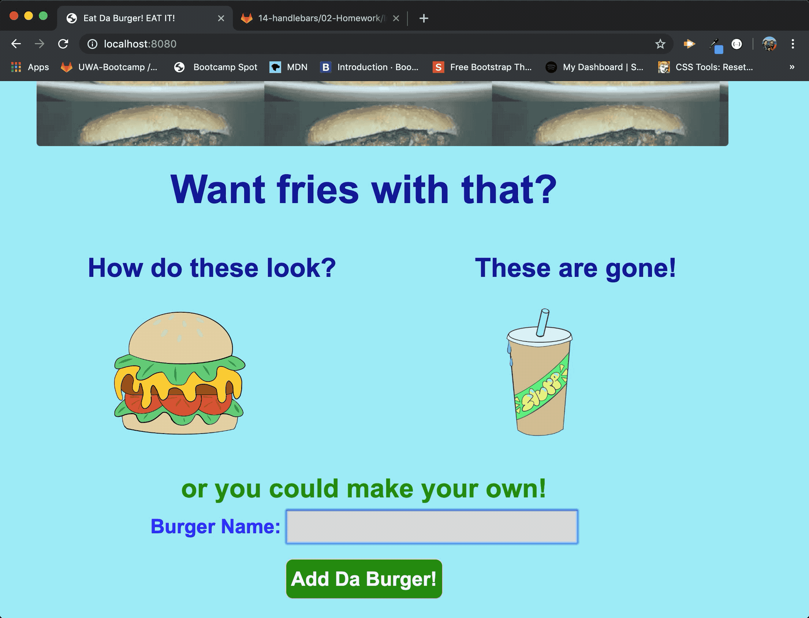
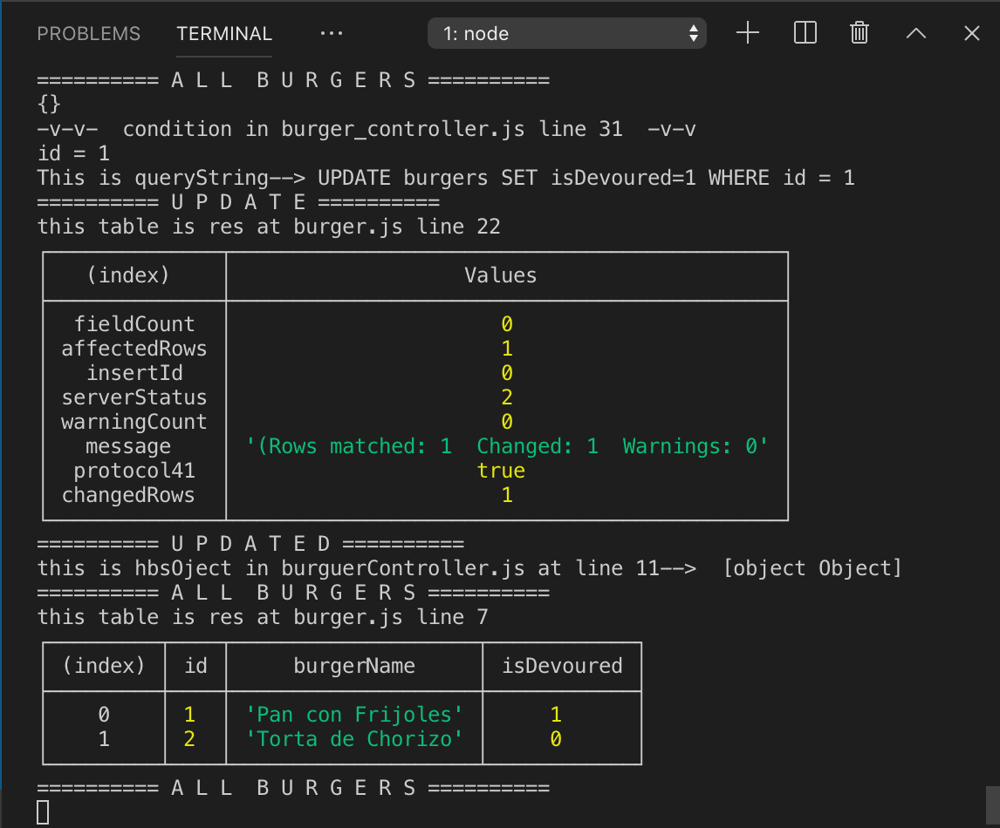

# **Da Burger exercise**
Burger logger with MySQL, Node, Express, Handlebars and a homemade ORM (yum!). Be sure to follow the MVC design pattern; use Node and MySQL to query and route data in your app, and Handlebars to generate your HTML.

## **Burger log Web Application**

This full-stack app, allows the user to choose from existing burgers to be devoured and transfered them to the devoured "state", it also allows the users to "create" their own burger.
New entries update the existing database, adding a row with an id, burger name and value of not devoured.
In this control enviroment case, the app displays the created burger in the left hand side of the page along with those already in the database that have not been devoured.

## **Instructions to run DaBurger**
1. Access the app at tbd
2. Click the "DEVOURE IT!" button on the left hand side of the screen to switcht the value of the burger from not devoured to devoure, displaying it in red on the right hand side.
3. Add a burger of your choosing by writing the name of a burger in the input field and clicking the button labeled "add da burger!".
4. You then have the option "devoure" the new burger.

## **Technologies used**
HTML 
css 
Bootstrap 
Express 
Node.js 
MySQL 
Handlebars 
Heroku

### **Role in development of the app**
I put together this app following instructional direction, research, code reviews and provided base code; if you would like to know more about it you may contact me at marino.carranza@gmail.com 

### **Here is a quick demonstration**

### **This is a screen capture of the empty database before the inputs were typed and the results after the database was updated.**

